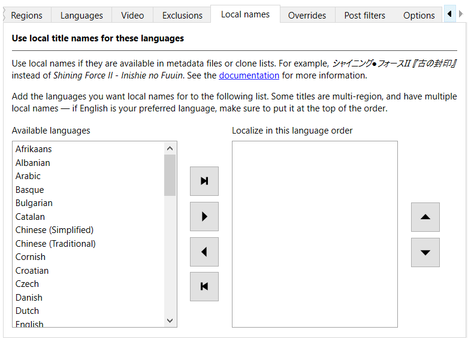

---
hide:
  - footer
---

# Local names

!!! note
    Local names are a [work in progress](#wip), and need community help to complete. You
    can contribute directly by [editing clone lists](contribute-clone-lists.md) and
    [filing a pull request](contribute-clone-lists-pull-request.md), or if you're not
    familiar with code, by [filing an issue](https://github.com/unexpectedpanda/retool/issues).

The No-Intro and Redump standard is to romanize title names from languages that don't
use a Latin-based alphabet. They also restrict filenames to the
[7-bit ASCII character set](https://montcs.bloomu.edu/Information/Encodings/ascii-7.html),
which removes vital pronunciation cues from even latin-derived alphabets.

While this is useful as a standard for those who primarily speak English or are managing a
collection, it's not great for those looking to operate in their own language, or for
people who are multilingual.

Retool can use local names for titles if they are available in metadata files or clone
lists. For example, the Japanese `シャイニング●フォースⅡ 『古の封印』` instead of the
romanized `Shining Force II - Inishie no Fuuin`.

## Change the local names order

To view the languages you can use for local names, in the **Global settings** or
**System settings** tab, click the **Local names** tab.

!!! note
    Some titles are multi-region, and have multiple local names. If English is your
    preferred language, make sure to put it at the top of the order.

You can move languages from the **Available languages** box to the
**Localize in this language order** box in the following ways:

* Drag and drop with the mouse.
* Select one or more languages in the **Localize in this language order** box, and then
  click {:.inline-icon .move-button}
  **Remove languages**.
* Click {:.inline-icon .move-button}
  **Remove all languages**, which returns all languages to the **Available languages**
  box.

You can change the order of the languages in the **Localize in this language order** box
in the following ways:

* Drag and drop with the mouse.

* Select one or more languages in the **Localize in this language order** box, and then
  click {:.inline-icon .move-button}
  **Up** or {:.inline-icon .move-button}
  **Down**.

!!! tip
    A combination of ++ctrl++ (++cmd++ on macOS), ++shift++, and clicking allows for
    multiple language selections.

## Local names status {:#wip}

Providing local names for titles is a large job and a work in progress. For now, Retool is
focusing on completing the priority systems detailed in the following table, in order.
Other systems are being handled on an ad-hoc basis.

<table>
    <thead>
        <tr>
            <th>System name</th>
            <th>Stage</th>
        </tr>
    </thead>
    <tbody>
        <tr style="background-color:rgba(245,167,0,0.4);">
            <td>Nintendo - Nintendo Entertainment System</td>
            <td>Adding local names to clone lists</td>
        </tr>
        <tr style="background-color:rgba(245,93,0,0.4);">
            <td>Sony - PlayStation</td>
            <td>Partially cleaned metadata</td>
        </tr>
        <tr style="background-color:rgba(245,93,0,0.4);">
            <td>Sony - PlayStation 2</td>
            <td>Partially cleaned metadata</td>
        </tr>
        <tr style="background-color:rgba(245,167,0,0.4);">
            <td>Nintendo - Super Nintendo Entertainment System</td>
            <td>Adding local names to clone lists</td>
        </tr>
        <tr style="background-color:rgba(245,167,0,0.4);">
            <td>Sega - Megadrive/Genesis</td>
            <td>Adding local names to clone lists</td>
        </tr>
        <tr style="background-color:rgba(245,167,0,0.4);">
            <td>Sega - Master System/Mark III</td>
            <td>Adding local names to clone lists</td>
        </tr>
        <tr style="background-color:rgba(245,167,0,0.4);">
            <td>Nintendo - Nintendo 64</td>
            <td>Adding local names to clone lists</td>
        </tr>
        <tr style="background-color:rgba(245,167,0,0.4);">
            <td>Nintendo - Game Boy</td>
            <td>Adding local names to clone lists</td>
        </tr>
        <tr style="background-color:rgba(245,167,0,0.4);">
            <td>Nintendo - Game Boy Advance</td>
            <td>Adding local names to clone lists</td>
        </tr>
        <tr style="background-color:rgba(245,167,0,0.4);">
            <td>Nintendo - Nintendo 3DS</td>
            <td>Adding local names to clone lists</td>
        </tr>
        <tr style="background-color:rgba(245,167,0,0.4);">
            <td>Nintendo - Nintendo DS</td>
            <td>Adding local names to clone lists</td>
        </tr>
        <tr style="background-color:rgba(245,93,0,0.4);">
            <td>Nintendo - Wii</td>
            <td>Partially cleaned metadata</td>
        </tr>
        <tr style="background-color:rgba(245,93,0,0.4);">
            <td>Microsoft - Xbox 360</td>
            <td>Partially cleaned metadata</td>
        </tr>
        <tr style="background-color:rgba(245,93,0,0.4);">
            <td>Sony - PlayStation 3</td>
            <td>Partially cleaned metadata</td>
        </tr>
        <tr style="background-color:rgba(245,93,0,0.4);">
            <td>Microsoft - Xbox</td>
            <td>Partially cleaned metadata</td>
        </tr>
    </tbody>
</table>

There are three stages to providing local names:

1. **Cleaning up the original metadata from No-Intro and Redump.** This involves removing
   incorrect or unsuitable alternate names, and making changes in clone lists where
   necessary to compensate for multi-region games with multiple names.  
   During this stage, you mostly get local names straight from the No-Intro and Redump
   databases. These might be incorrect.

1. **Adding local names to clone lists.** This involves going through non-English region
   games and multi-language games in each DAT file, and checking for local names.  
   During this stage, you'll start getting more correct local names, especially for titles
   that have multiple local names.

1. **Complete.** The first two passes are complete. This doesn't mean the job is done
   &mdash; DAT files are always updating, titles are going to be missed, and some might be
   incorrect due to not being a contributor's native language. Community contributions are
   absolutely welcome to fill the gaps.
