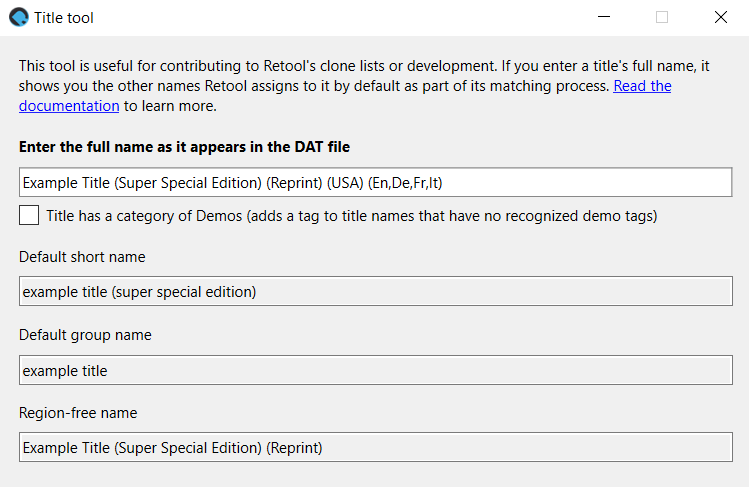

---
hide:
  - footer
---

# Retool's naming system

Retool generates multiple names for each [title](terminology.md#titles) in a DAT file to
help match and group together titles more accurately. These names are used directly in the
code, and also clone lists. If you plan to contribute to Retool, it helps to understand
this standard.

## Title tool

Retool's different naming conventions can take a while to get used to. To help you
start, you can use the title tool in Retool GUI. Open Retool GUI, then click
**File > Title tool** to launch it. Paste in the full name you've found in the DAT
file you're working on, and it shows you the other names Retool assigns to that title by
default.



## Full names

Full names are the names of titles as presented in the DAT file, including tags. For
example:

```
This is a title (USA) (En,Fr) (Disc A) (Best Collection)
```

## Short names

Short names are a shortened version of full names, most often used in clone lists as a
handy way to reference many titles at once without having to list the full name of every
variant.

For example, all of the following title full names:

```
This is a title (USA) (En,Fr) (Disc A) (Best Collection)
This is a title (Canada) (Disc 1)
This is a title (Europe) (De,It) (Disc A)
This is a title V3 (Spain) (Disco Uno)
```

Have the following short name:

```
this is a title (disc 1)
```

Adding this short name to a clone list finds all the full name titles previously listed.

A short name is built by making the following changes to the full name:

1.  Normalizing disc names. Retool attempts to align all naming variants for discs to the
    one standard for better automated matching of titles. That is, variants like
    _(Disc 1)_, _(Disc A)_, _(Disco Uno)_, and _(Side A)_ are all _(Disc 1)_ as far as
    Retool is concerned. Normalized disc names should also be used in clone lists
    wherever short names are used.

    The replace strings for normalized disc names are in the `disc_rename` object in
    `config/internal-config.json`. This is not a 1:1 mapping of what the disc name is and
    what it should be. Instead, it's a sequential set of string replacements that's
    iterated over when processing a title's full name, so the order is important.

1.  Removing [tags](terminology.md#tags) and version-like strings as defined in the
    `ignore_tags`, `promote_editions`, `demote_editions`, and `modern_editions` arrays in
    `config/internal-config.json`

1.  Removing regions and languages.

1.  Converting the name to lowercase.

The short name also acts as a differentiator for titles that get bundled into the same
group, but shouldn't be treated as 1:1 matches.

For example, the following full names:

```
This is a title (USA) (En,Fr) (Disc A) (Best Collection)
This is a title (USA) (En,Fr) (Disc B) (Best Collection)
```

Are both assigned to the same group by default:

```
this is a title
```

However, because they are different discs from the same set and not equivalent titles,
they get assigned different short names:

```
this is a title (disc 1)
this is a title (disc 2)
```

This prevents them from being considered as clones of each other.

## Group names

Group names are how Retool bundles together similar titles to compare against each other.

By default, group names are discovered by Retool taking only the content before the
first `(` in full names, and then converting to lowercase. Additionally, any string that
looks like a version is removed.

For example, the following full names:

```
This is a title v1.00 (USA) (En,Fr) (Disc A) (Best Collection)
This is a title v1.00 (USA) (En,Fr) (Disc B) (Best Collection)
```

Are both assigned to the same group by default:

```
this is a title
```

Group can also be set manually in the [`variants`](contribute-clone-lists-variants.md) array in
a clone list.

## Region-free names

Region-free names are the same as full names, except their regions and languages have been
removed.

For example, the following full name:

```
This is a title (USA) (En,Fr) (Disc A) (Best Collection)
```

Has the following region-free name:

```
This is a title (Disc A) (Best Collection)
```
